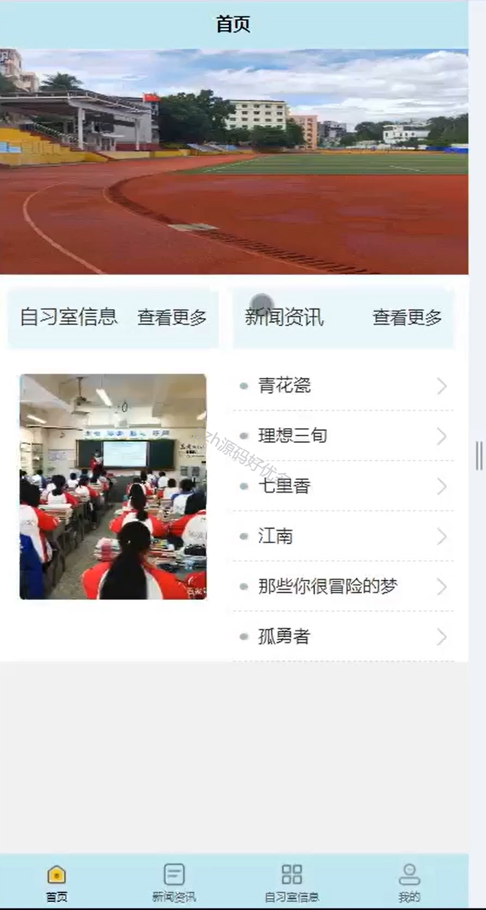

# mpweixinA070
mpweixinA070付费选座自习室微信小程序（Vue3+原生+unipp）
 
## 查看主页获取源码

### 一、作品包含

源码+数据库+全套环境和工具资源+部署教程

### 二、项目技术

前端技术：Html、Css、Js、Vue3.0、Element-ui、Uniapp

数据库：MySQL

后端技术：Java、Spring Boot、MyBatis

  

### 三、运行环境

开发工具：IDEA/eclipse + HBuilderX + 微信开发者工具

数据库：MySQL5.7（最低要5.7版本）

数据库管理工具：Navicat10以上版本

环境配置软件： JDK1.8+Maven3.6.3

前端Nodejs：16

### 四、项目介绍
项目编号：mpweixinA070

基于微信小程序的付费选座自习室系统是一个为学生提供方便、快捷的自习场所预定服务的平台。该系统分为用户和管理员两个角色，用户可以通过微信小程序浏览自习室信息、预定座位，而管理员负责管理用户信息、自习室资源以及系统公告。

### 五、运行截图

  
